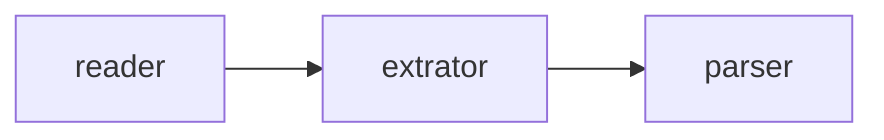

# AGENTS.md

## Project Context
This project uses the `uv` package manager and `pyproject.toml` for dependency management and configuration. The target Python version is 3.13. All commands must be run within the `uv` managed environment.

## Agent Instructions
When working on this project, the agent **MUST** adhere to the following rules:

- **ALWAYS** use `uv run <command>` instead of invoking `python`, `pytest`, or other tools directly.
- **NEVER** use `pip` or `pip3` for installing or managing packages.
- **ALWAYS** run `uv sync` to install/update dependencies after changes to `pyproject.toml`.
- **ALWAYS** run quality checks (`format`, `lint`, `typecheck`, `test`) before proposing any changes.
- **MAINTAIN** existing code formatting and style, primarily enforced by `ruff` and `mypy`.

## Useful Commands (for the AI Agent)

- **Install dependencies**: `uv sync`
- **Run a script**: `uv run python script.py`
- **Run tests**: `uv run pytest`
- **Run linting**: `uv run ruff check .`
- **Format code**: `uv run ruff format .`
- **Run type checking**: `uv run mypy`
- **Add a new package**: `uv add <package-name>`
- **Remove a package**: `uv remove <package-name>`
- **Create a virtual environment** (if needed): `uv venv`

## Project Structure
- `src/`: Contains all application-level code.
- `agents/`: Contains AI agent operational logs, learnings, errors, and task records for self-improvement and context management.
- `tests/`: Contains all unit and integration tests (using `pytest`).
- `pyproject.toml`: The main configuration and dependency file.
- `AGENTS.md`: This file, providing context and instructions.
- `scripts/`: Contains all tools you can use for completing the job.

## 概念

- `reader`: 负责读取目标网页，获得`html`代码
- `extrator`: 负责从`beautifulsoup4`提取正文、标题、摘要等有用内容，排除无用`html`标签
- `parser`: `html`->`markdown`核心转换引擎
- `OmniArticleMarkdown`: 将`readers`、`extrators`和`parser`串联起来的工具



## 自动化工作流示例 (Agent 执行步骤)

- **明确本次任务的角色**：是`reader-developer`、`extractor-developer`还是两者兼有
- **读取角色技能**：在`skills/`目录下找到角色对应的技能
- **进行开发编码工作**，不需要编写测试用例，除非明确要求
- **记录开发日志**：追加到`agents/logs.md`，格式为：

```markdown
## [LOG-YYYYMMDD-XXX] Task Name

### Overview
Briefly describe what was done and what problem was solved.

### Details
- Key point 1
- Key point 2
- Key point 3

### Results
- Achievements / Outputs
- Remaining or follow-up items

---
```
