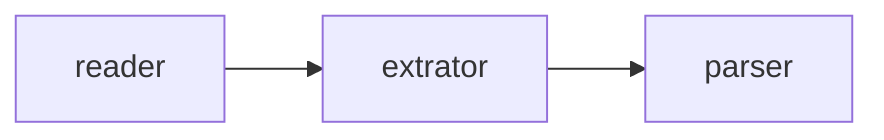

# AGENTS.md

## First Message

If the user did not give you a concrete task in their first message, read `task.md` to get the core objectives outlined in the file.

## Project Context
This project uses the `uv` package manager and `pyproject.toml` for dependency management and configuration. The target Python version is 3.13. All commands must be run within the `uv` managed environment.

## Agent Instructions
When working on this project, the agent **MUST** adhere to the following rules:

- **ALWAYS** use `uv run <command>` instead of invoking `python`, `pytest`, or other tools directly.
- **NEVER** use `pip` or `pip3` for installing or managing packages.
- **ALWAYS** run `uv sync` to install/update dependencies after changes to `pyproject.toml`.
- **ALWAYS** run quality checks (`format`, `lint`, `typecheck`, `test`) before proposing any changes.
- **MAINTAIN** existing code formatting and style, primarily enforced by `ruff` and `mypy`.

## Useful Commands (for the AI Agent)

- **Install dependencies**: `uv sync`
- **Run a script**: `uv run python script.py`
- **Run tests**: `uv run pytest`
- **Run linting**: `uv run ruff check .`
- **Format code**: `uv run ruff format .`
- **Run type checking**: `uv run mypy`
- **Add a new package**: `uv add <package-name>`
- **Remove a package**: `uv remove <package-name>`
- **Create a virtual environment** (if needed): `uv venv`

## Project Structure
- `src/`: Contains all application-level code.
- `tests/`: Contains all unit and integration tests (using `pytest`).
- `pyproject.toml`: The main configuration and dependency file.
- `AGENTS.md`: This file, providing context and instructions.
- `scripts/`: Contains all tools you can use for completing the job.

## 概念

- `reader`: 负责读取目标网页，获得`html`代码
- `extrator`: 负责从`beautifulsoup4`提取正文、标题、摘要等有用内容，排除无用`html`标签
- `parser`: `html`->`markdown`核心转换引擎
- `OmniArticleMarkdown`: 将`readers`、`extrators`和`parser`串联起来的工具



## 开发流程

- 阅读`README`了解项目功能
- 对于新接入的网站，分别在`readers`和`extractors`目录下新建一个类继承各自的父类，引擎会自动加载
- 第一步，你需要正确编写`reader`以抓取到目标网页的`html`代码，你可以使用如下工具：
  - 普通抓取，使用`requests`库进行简单抓取
    - `uv run python scripts/fetch_url.py <url>`
    - `uv run python scripts/fetch_url.py <url> --curl`，伪装成`curl`
  - 使用无头浏览器进行抓取，适用于需要`javascript`的网站
    - `uv run python scripts/fetch_url_playwright.py <url>`，适用于大多数静态或加载较快的动态网页
    - `uv run python scripts/fetch_url_playwright.py <url> -m scroll`，适用于需要时间加载且必须滚动到底部才能加载完整内容的 SPA（单页应用）
- 如果使用工具无法抓取到正文，可能是`js`后台异步请求了一些接口，你可以用以下工具嗅探一下`js`的后台请求：
  - `uv run python scripts/log_js_request.py <url>`
- 原则上优先使用`requests`，再使用`playwright`
- 如果目标网站遇到以下情况，立刻停止并记录开发日志
  - 无论如何无法抓取到正文
  - 网站有人机交互检查
  - 网站无法访问（连接中断、404、500等）
  - 需要登录才能访问
- 第二步，你需要正确编写`extractor`对`soup`对象做清理，过滤掉以下内容，使得文章尽可能干净：
  - 广告
  - 作者介绍、用户头像等
  - 求关注、推广链接等
  - 菜单、目录、`TOC`等与正文无关内容
- 最后：
  - 使用该命令对转换后的`markdown`做最后的验证：`uv run mdcli <url>`
  - 使用该命令可以对你编写的`reader`对抓取到的`html`进行验证：`uv run mdcli read <url>`

## 开发日志

`AGENT_NOTES.md`是你的开发日志，是你对本次开发过程的总结。

开发日志这样编写：

```
## {当前时间}

- 内容1
- 内容2
...
```
