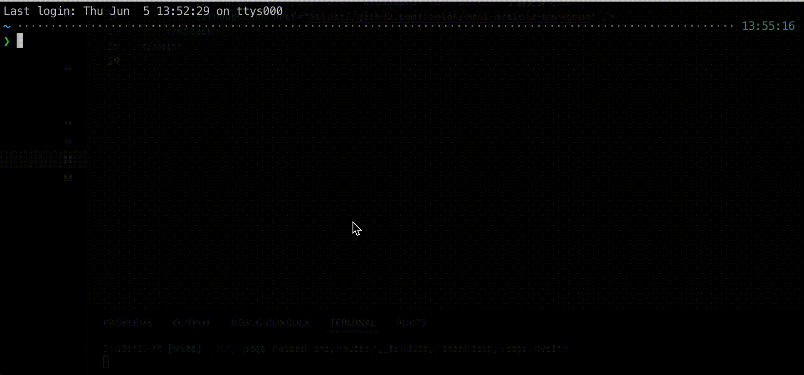
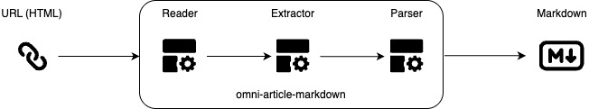

# 墨探 (omni-article-markdown)

轻松将网页文章（博客、新闻、文档等）转换为 `Markdown` 格式。



---

## Recent changes:

- extractor模块化，将提取逻辑按网站分割，便于维护和社区贡献。
- 添加插件机制，复杂的页面可以通过插件进行扩展
- 添加对github gist的支持
  - 示例：https://towardsdatascience.com/hands-on-multi-agent-llm-restaurant-simulation-with-python-and-openai
- 添加对katex公式的支持
  - 示例：https://quantum.country/qcvc

---

## 功能介绍
墨探的开发初衷，是为了解决一个问题：如何将来自互联网上各种不同网站的文章内容，精准且高效地转换成统一的Markdown格式。

众所周知，万维网上的网站设计风格迥异，其HTML结构也呈现出千差万别的特点。这种多样性给自动化内容提取和格式转换带来了巨大的困难。要实现一个能够适应各种复杂HTML结构的通用解决方案，并非易事。

我的想法是：从特定的网站开始适配，以点到面，逐步抽取出通用的解决方案，最后尽可能多的覆盖更多网站。以下是一些我经常访问的的网站，支持的都不错：

- 掘金
- CSDN
- Medium
- Freedium
- 公众号
- 简书
- 知乎专栏
- 今日头条
- towardsdatascience
- quantamagazine

---

## 架构设计



墨探主要分为三个模块：

- **Reader** 模块的功能是读取整个网页内容
- **Extractor** 模块的功能是提取正文内容，清理无用数据
- **Parser** 模块的功能是将 HTML 转换为 Markdown

## 快速开始

1. 安装主程序

```sh
pip install omni-article-markdown
```

2. 安装插件（可选）

```sh
mdcli install zhihu
```

3. 运行命令：

```sh
mdcli https://zhuanlan.zhihu.com/p/123456789
```

### 参数说明

运行命令及参数如下：

```sh
mdcli <URL_OR_PATH> [-s [SAVE_PATH]]
```

| 参数               | 说明 |
|--------------------|------|
| `URL_OR_PATH`     | **必填**，目标网页 URL 或本地 HTML 文件路径。 |
| `-s, --save`      | **可选**，启用保存：<br> - 仅 `-s`：默认保存至 `./`。<br> - `-s <SAVE_PATH>`：保存至指定路径。 |

---

## 使用示例

### 仅转换
```sh
mdcli https://example.com
```

内容会输出值`stdout`。

### 转换并保存到当前目录

```sh
mdcli https://example.com -s
```

会在当前目录生成一个`<title>.md`的文件。

### 转换并保存到指定路径

```sh
mdcli https://example.com -s /home/user/
```

会在`/home/user/`目录生成一个`<title>.md`的文件。

```sh
mdcli https://example.com -s /home/user/data.md
```

会生成一个`/home/user/data.md`的文件。

---

## 安装和使用插件

[「墨探」是如何使用插件机制构建可扩展架构的](https://babyno.top/posts/2025/06/a-deep-dive-into-the-extensible-architecture-of-omni-article-markdown/)

**安装命令格式：**

```sh
mdcli install <PLUGIN_NAME_OR_PACKAGE_NAME> [-U] [-e]
```

| 参数                             | 说明                                                                 |
|----------------------------------|----------------------------------------------------------------------|
| `<PLUGIN_NAME_OR_PACKAGE_NAME>` | **必填**，插件的名称或其在 PyPI 上的完整包名。 |
| `-U, --upgrade`                  | **可选**，如果插件已安装，则尝试升级到最新版本。                          |
| `-e, --editable`                  | **可选**，基于提供的本地文件路径安装可编辑的包。                          |

**示例：安装知乎解析插件**

```sh
mdcli install zhihu
```

或者，你可以使用 `-e` 参数安装本地可编辑的包。

```sh
mdcli install -e "./plugins/omnimd-zhihu-reader"
```

安装成功后，当下一次运行 `mdcli` 解析知乎链接时，如果该插件正确实现了接口，它将被自动用于处理该链接。

### 如何卸载插件？

如果你想移除一个已安装的插件，可以使用 `mdcli` 提供的 `uninstall` 命令。

**卸载命令格式：**

```sh
mdcli uninstall <PLUGIN_NAME_OR_PACKAGE_NAME> [-y]
```

| 参数                             | 说明                                                     |
|----------------------------------|----------------------------------------------------------|
| `<PLUGIN_NAME_OR_PACKAGE_NAME>` | **必填**，要卸载的插件的名称或其在 PyPI 上的完整包名。 |
| `-y, --yes`                      | **可选**，在卸载前不进行确认提示。                         |

**示例：卸载知乎解析插件**

```sh
mdcli uninstall zhihu
```

或者，使用插件的全称删除

```sh
mdcli uninstall omnimd-zhihu-reader
```

卸载后，该插件的功能将不再可用。对于之前由该插件处理的 URL，`mdcli` 将会回退到其默认的解析逻辑。

### 已支持的插件

目前已发布3个插件，你可以按需安装：

| 命令                             | 说明                                                     |
|----------------------------------|----------------------------------------------------------|
| `mdcli install zhihu`              | 知乎专栏 |
| `mdcli install toutiao`            | 今日头条                         |
| `mdcli install freedium`           | Freedium                         |

### 开发自己的插件

---

## 贡献与反馈
- 发现解析问题？欢迎提交 [Issue](https://github.com/caol64/omni-article-markdown/issues)
- 改进解析？欢迎贡献 [Pull Request](https://github.com/caol64/omni-article-markdown/pulls)
- 开发插件？文档正在筹备中

---

## 赞助

如果您觉得不错，可以给我家猫咪买点罐头吃。[喂猫❤️](https://yuzhi.tech/sponsor)

---

## License

MIT License
